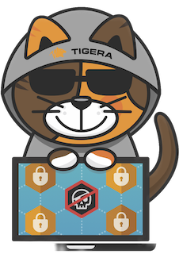

# prevent-detect-and-mitigate-container-based-threats

Using a recent real-world example, we'll illustrate how to prevent, detect and mitigate the risk of container-based threats using [Calico Cloud](https://www.calicocloud.io/home).

The [Spring Boot web application](https://github.com/christophetd/log4shell-vulnerable-app) used in this workshop is vulnerable to Log4Shell ([CVE-2021-44228](https://nvd.nist.gov/vuln/detail/CVE-2021-44228)).

## Learning Objectives

This [workshop](#workshop-modules) will teach you how to use [Calico Cloud](https://www.calicocloud.io/home) to protect mission-critical applications from container-based threats. You will learn how to assess your applications for vulnerabilities before deploying them to Kubernetes clusters, and how to set policies to control whether they are allowed to run. You will also learn how to exploit a vulnerable application to exfiltrate sensitive information and gain remote access. Finally, you will learn how to detect and observe attacks in real-time, isolate the intruder elements, and gather evidence to report the incident.

We will guide you through the following Calico Cloud use cases:

### Image Assurance

- Detect vulnerabilities in container images at build and runtime.

- Use policy to prevent vulnerable container images from being deployed.

### Dynamic Service and Threat Graph

- Expose reconnaissance gathering and exploitation attempts.

- Observe data exfiltration of sensitive information leaving the cluster.

### Deep Packet Inspection

- Detect exploitation attempts by evaluating workload traffic against intrusion detection signatures.

### Malware Detection

- Detect the presence of malicious files and processes in compromised workloads.

### Workload-based Web Application Firewall (WAF)

- Detect and block OWASP top 10 and other threats like Log4Shell.

## Workshop Prerequisites

- k8s cluster of your choosing
- `Docker`
- `curl`
- `kubectl`

## Workshop Modules

- [Module 1: Creating a Kubernetes cluster](doc/k8s.md)
- [Module 2: Join the cluster to Calico Cloud](doc/calicocloud.md)
- [Module 3: Introduction to the Log4j vulnerability](doc/intro.md)
- [Module 4: Prevent](doc/prevention.md)
- [Module 5: Detect](doc/detection.md)
- [Module 6: Exploit](doc/exploitation.md)
- [Module 7: Mitigate](doc/mitigation.md)
- [Module 8: Respond](doc/incidentresponse.md)

## Reference

- [Tigera - How security policies can protect your environment from future vulnerabilities like Log4j](https://www.tigera.io/blog/how-network-security-policies-can-protect-your-environment-from-future-vulnerabilities-like-log4j)
- [Tigera - Zero trust for cloud-native workloads: Mitigating future Log4j incidents](https://www.tigera.io/blog/zero-trust-for-cloud-native-workloads-part-2-mitigating-future-log4j-incidents)
- [Amazon - Using AWS security services to protect against, detect, and respond to the Log4j vulnerability](https://aws.amazon.com/blogs/security/using-aws-security-services-to-protect-against-detect-and-respond-to-the-log4j-vulnerability)
- [Microsoft - Guidance for preventing, detecting, and hunting for exploitation of the Log4j 2 vulnerability](https://www.microsoft.com/en-us/security/blog/2021/12/11/guidance-for-preventing-detecting-and-hunting-for-cve-2021-44228-log4j-2-exploitation)
