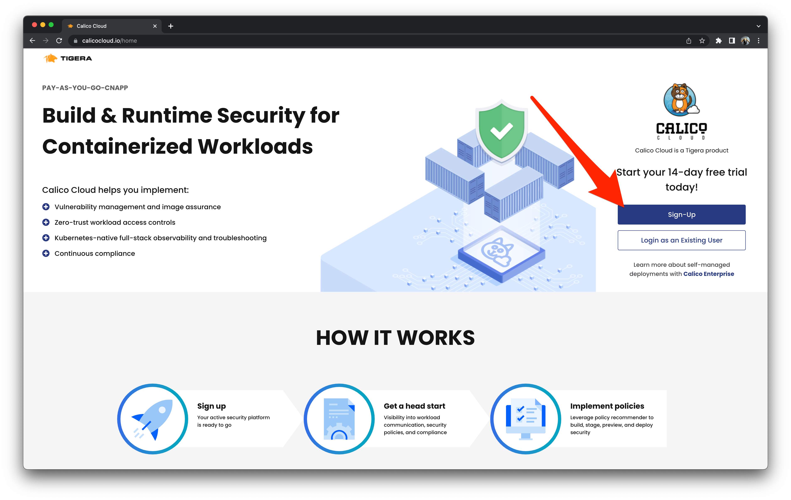
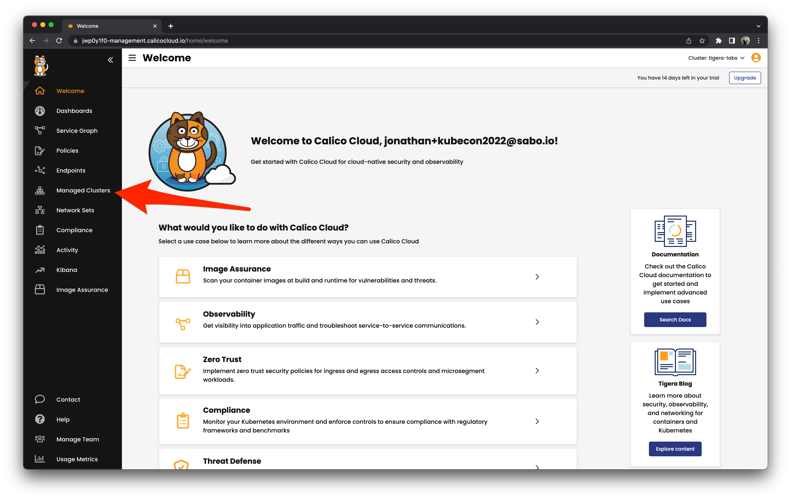
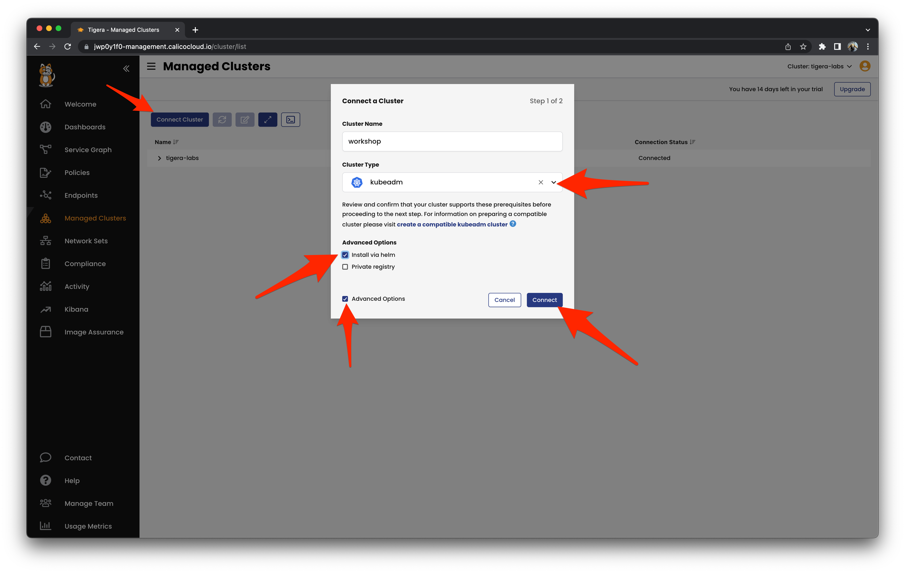
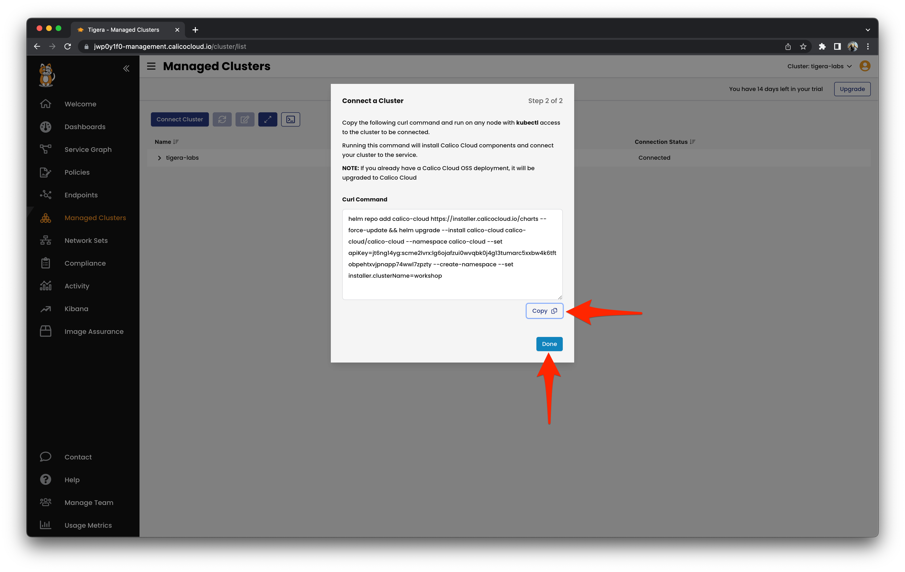
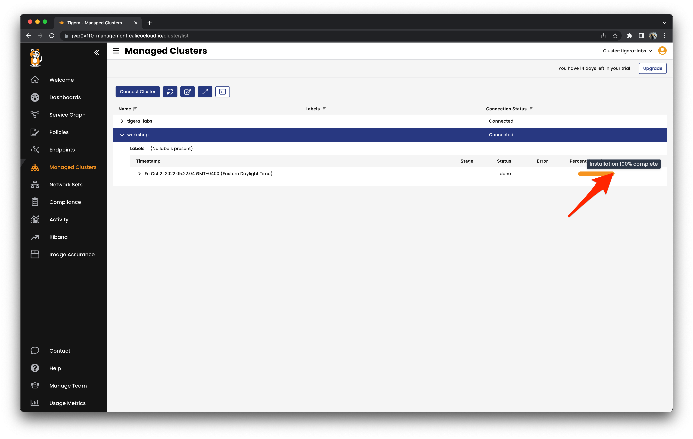
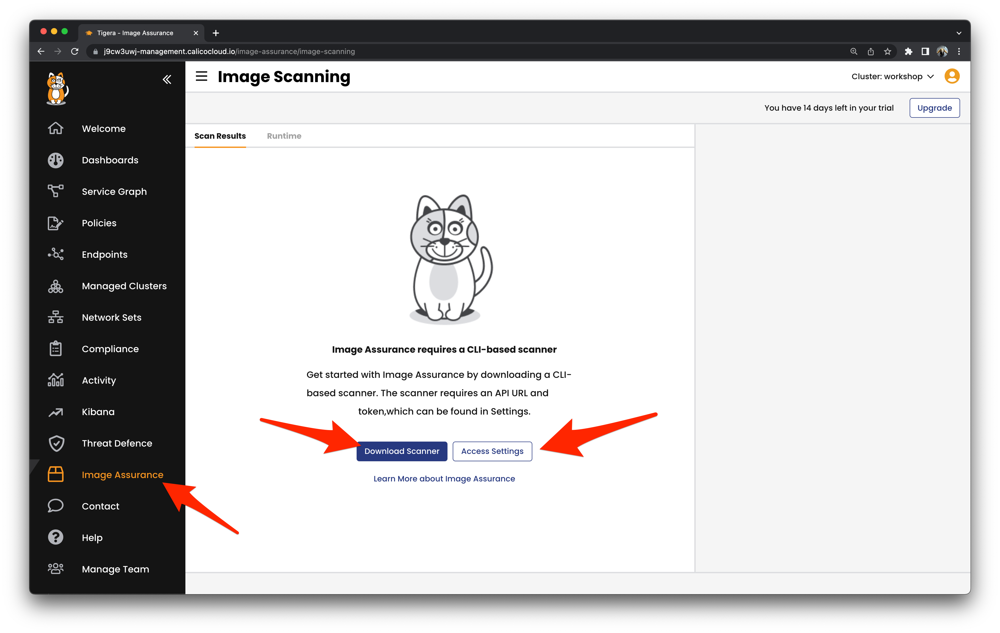
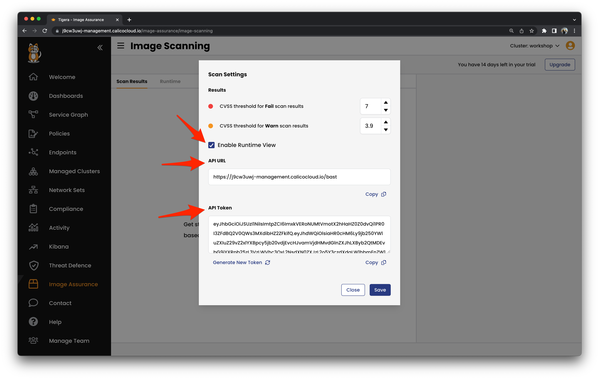

# Join the cluster to Calico Cloud

## Sign up for Calico Cloud

Browse to [calicocloud.io](http://calicocloud.io) and sign up for a free trial account for the workshop.

Be sure to check your Inbox to validate your email address.



## Connect workshop cluster

Browse to Managed Clusters on the side bar and click on `Connect Cluster`.

Let's connect the cluster we just created.



Enter `workshop` or a name of your choice for the `Cluster Name` and choose the appropriate `Cluster Type`.  Select `Advanced Options` and you should be able to select `Install Via Helm`.

If you brought your own cluster for the workshop, select the options for your cluster type.



When you click on the blue `Connect` button you will be able to copy and paste the Helm commands into your terminal.  This will upgrade Calico and connect your cluster to Calico Cloud.



You should see some output in your terminal instructing you on how to monitor the progress of the upgrade and connection to Calico Cloud in your terminal.  You can also monitor the progress in Calico Cloud.

```
kubectl get installer default --namespace calico-cloud -o jsonpath --template '{.status}' -w
```

```
{"clusterName":"workshop","imagePath":"","message":"","registry":"","resourceVersion":"gjkhzdtr","state":"done"}
```



When the installation is 100% completed confirm with the Calico Cloud operator that everything is up and running.

```
kubectl get tigerastatus
```

```
NAME                            AVAILABLE   PROGRESSING   DEGRADED   SINCE
apiserver                       True        False         False      42m
calico                          True        False         False      40m
compliance                      True        False         False      40m
intrusion-detection             True        False         False      40m
log-collector                   True        False         False      40m
management-cluster-connection   True        False         False      41m
monitor                         True        False         False      41m
```


## Setup Tigera Container Image Scanner

`tigera-scanner` is a tool designed by Tigera to scan container images for vulnerabilities. When using this scanner, you receive information about any vulnerabilities found in the container image and can choose to send this information to Calico Cloud.

Download the cli based scanner for your particular operating system by clicking on the `Download Scanner` button.



Enable the Runtime view and configure the cli based scanner to send the local scan results to Calico Cloud.



By enabling the Runtime View setting in the Scan Settings, Calico Cloud will constantly monitor the pods running in your Kubernetes clusters. This allows Calico Cloud to associate the running pods with the images you have previously recorded in the Image Assurance system.

Create a hidden file named `.tigera-scanner.yaml` in your home directory. In this file, you will need to copy the API URL and API Token that you can find in Calico Cloud. Make sure to include both the URL and the token in the file as shown below.

```
---
apiurl: <API URL GOES HERE>
token: <API TOKEN GOES HERE>
warn_threshold: 3.9
fail_threshold: 7
```


[Next -> Module 3](intro.md)
