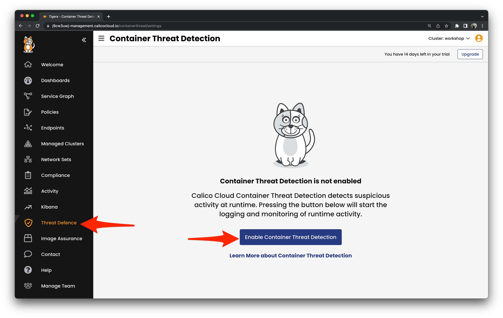

# Detection


## Enable Deep Packet Inspection

Detect exploitation attempts by evaluating workload traffic against intrusion detection signatures.

```
kubectl apply -f workshop/dpi
```

## Enable eBPF based Container Threat Detection

Detect the presence of malicious files and processes in compromised workloads.

Turn on Container Threat Detection for your cluster nodes in the Calico Cloud web ui. 



```
kubectl -n tigera-runtime-security annotate daemonset runtime-reporter unsupported.operator.tigera.io/ignore="true"
kubectl -n tigera-runtime-security get daemonset.apps/runtime-reporter -o yaml | sed 's/15m/1m/g' | kubectl apply -f -
```

## Dynamic Service and Threat Graph

Expose reconnaissance gathering and exploitation attempts. Observe data exfiltration of sensitive information leaving the cluster. 

Enable Application layer visibility and turn it on for our vulnerable `java-app`.

```
kubectl apply -f workshop/dsg
kubectl annotate svc java-app -n java-app projectcalico.org/l7-logging=true
```

Apply Global Alerts to enable signature-based anomaly detection.

```
kubectl apply -f workshop/alerts
```


[Next -> Module 6](exploitation.md)
