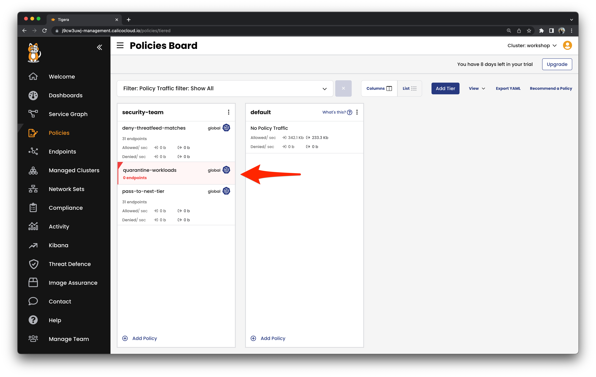
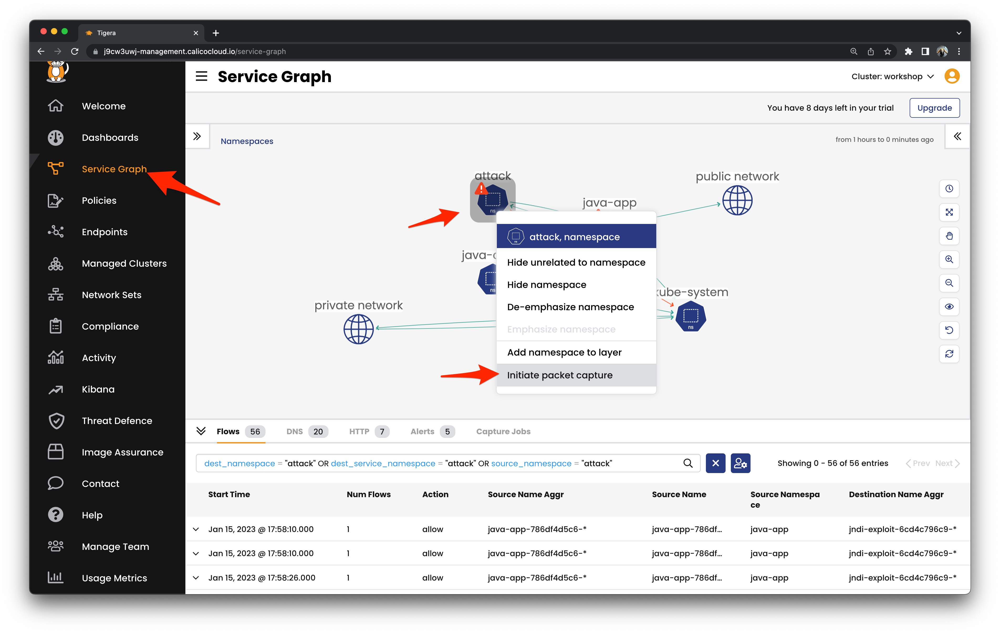

# Incident Response

## Containment

Isolating intruder elements by quarantining the source of the attacks.

```
kubectl apply -f workshop/secpols
```



```
kubectl label pod -n attack -l app=attack "quarantine=true" --overwrite
```


## Evidence Collection

Collect the flow, DNS, HTTP, alert event logs, and other relevant evidence.

Initiate Packet Capture to record all network traffic in the `attack` namespace.




**Congratulations! You have finished all the labs in the workshop.**


>Follow the cleanup instructions on the [main page](https://github.com/tigera-solutions/detect-and-mitigate-container-based-threats#workshop-modules) if needed.
