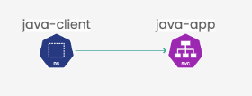

# Introduction to the Log4j vulnerability

## Overview

The log4j vulnerability is a security flaw that affects the log4j library, which is a popular logging utility used in Java applications. This vulnerability allows attackers to execute arbitrary code on the affected system by injecting malicious payloads into log messages.

The log4j vulnerability is caused by the lack of input validation in the log4j library. When log messages are processed, the log4j library does not properly sanitize the input, allowing attackers to inject malicious payloads into log messages. This can be done through various methods, such as using special characters or exploiting vulnerabilities in log message formatting.

The log4j vulnerability can be exploited to execute malicious code on the affected system, potentially giving attackers access to sensitive information or allowing them to manipulate the system for their own purposes.


## Scenario


## Let's get started

We will use this vulnerability to demonstrate how Calico Cloud can be used to prevent, detect, and mitigate the risk of threats that involve containers.

First, deploy the application we will use for the demonstration:

```
kubectl create -f apps/
```

This will create several resources for us: an attacker pod we will use to compromise our environment, a Web/LDAP server we will use to download malicious code, and a linux pod to have an availble bash environment to implement an admission controller in one of the workshop's modules. At the same time, two deployments will be created, those represent our main business application, which is constitued from a java web server, and a client which communicate each other through a service listening on port 8080 in our java server app:



[Next -> Module 4](prevention.md)
