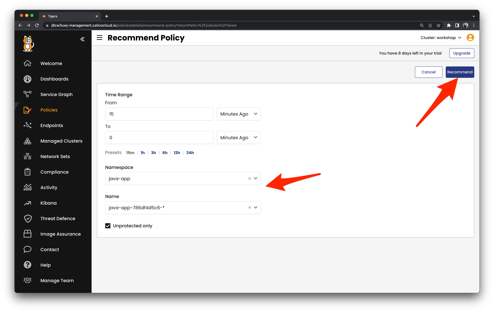

# Mitigation

## Enable Workload-centric Web Application Firewall (WAF) 

Workload-centric WAF will detect and block OWASP Top 10 and other attacks.

Enable WAF and apply the WAF ruleset to protect the vulnerable `java-app` from the malicious requests.

```
kubectl patch applicationlayer tigera-secure --type='merge' -p '{"spec":{"webApplicationFirewall":"Enabled"}}'
kubectl apply -f workshop/waf
```

Enable WAF protection for the `java-app` service.

```
kubectl annotate svc java-app -n java-app projectcalico.org/l7-logging=true
```

Malicous requests attempting to exploit the Log4Shell vulnerability will be detected and blocked.


## Enable Zerotrust Access Controls

Reduce the attack surface of the application by implementing a zero-trust security policy.

Use the Security Policy Recommender to create a security policy restricting access to the vulnerable `java-app`.




[Next -> Module 8](incidentresponse.md)
