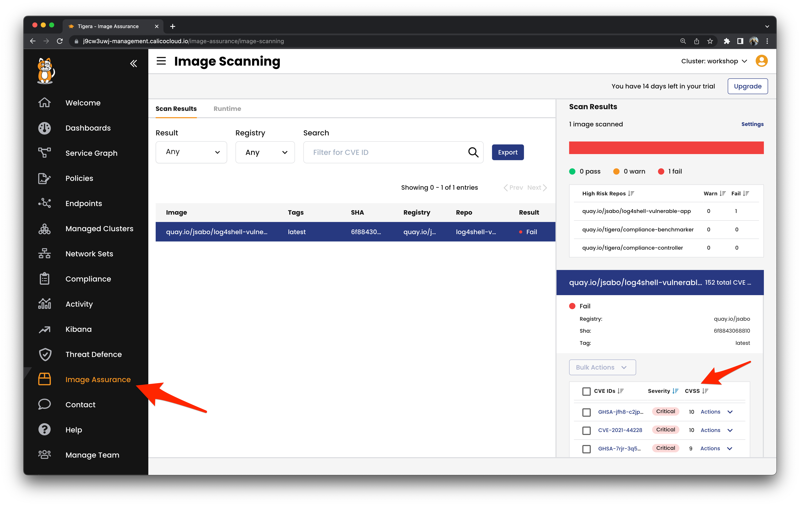

# Prevention


## Image Assurance

Detect vulnerabilities in container images at build and runtime.

Before deploying our application, let's [scan the images for vulnerabilities](https://docs.calicocloud.io/image-assurance/scan-image-registries) using the CLI.

```
docker pull quay.io/jsabo/log4shell-vulnerable-app:latest
tigera-scanner scan quay.io/jsabo/log4shell-vulnerable-app:latest
```

Explore the image scan results in Calico Cloud.



The command line interface (CLI) based scanner can easily be integrated into a developer's workflow and continuous integration/continuous delivery (CI/CD) pipelines.  For example, we have integrated the CLI based scanner into our development process using [Github Actions workflows](https://github.com/tigera-solutions/prevent-detect-and-mitigate-container-based-threats/blob/main/.github/workflows/run-tigera-scanner.yaml).

To view the results of the Tigera container scan, click on the workflow status badge below.

[](https://github.com/tigera-solutions/detect-and-mitigate-container-based-threats/actions/workflows/run-tigera-scanner.yaml)


## Admission Controller

Use policy to prevent vulnerable container images from being deployed.

Before [deploying the admission controller](https://docs.calicocloud.io/image-assurance/install-the-admission-controller), we have to create some certificates to secure the communication between the controller and the Kubernetes api.  Once we have the certs we can add them to the admission controller deployment and apply them to the cluster.  

```
curl https://installer.calicocloud.io/manifests/v3.14.1-16/manifests/generate-open-ssl-key-cert-pair.sh | bash
sed -i '' "s/BASE64_CERTIFICATE/$(base64 < admission_controller_cert.pem)/g" workshop/iaac/tigera-image-assurance-admission-controller-deploy.yaml
sed -i '' "s/BASE64_KEY/$(base64 < admission_controller_key.pem)/g" workshop/iaac/tigera-image-assurance-admission-controller-deploy.yaml
kubectl apply -f workshop/iaac
```

Let's deploy the workshop applications.

```
kubectl apply -f apps
```

The deployment of the java-app will fail because the Admission Controller policy is preventing the deployment of vulnerable workloads.


## Vulnerability Management

Our Runtime Security admission controller should prevent running applications with CVSS scores above 7.  These are `critical` vulnerabilities.


Add a vulnerability exception for each CVE and then redeploy.

```
kubectl apply -f apps
```


[Next -> Module 5](detection.md)
